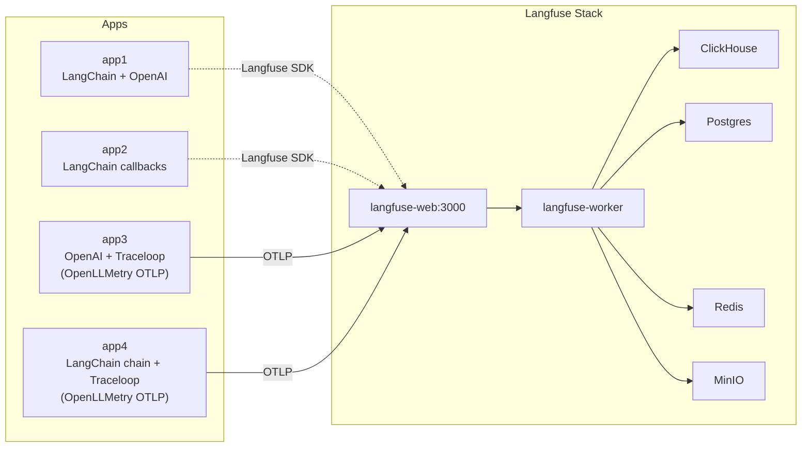
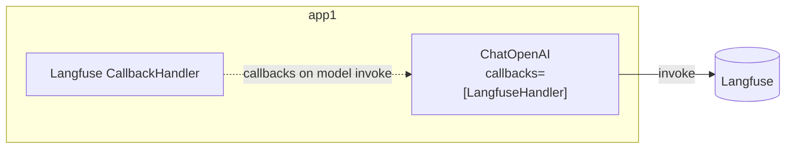
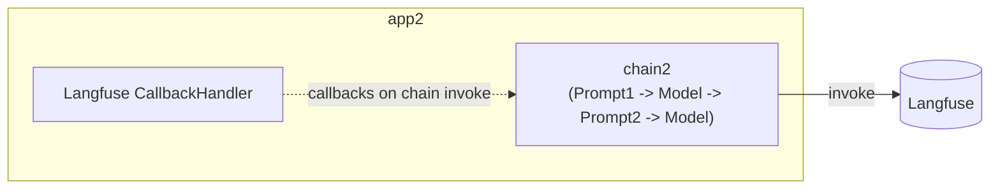
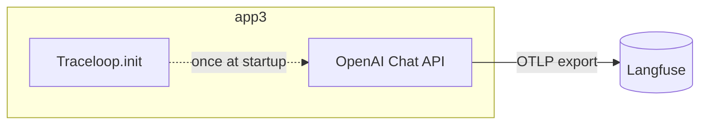
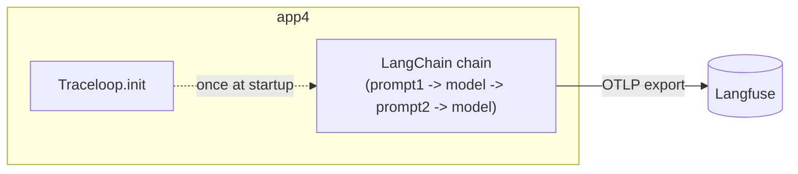

## はじめに

Langfuse を Docker Compose でローカル起動し、LangChain/OpenAI SDK を使った Python コードでトレースを OTLP (OpenTelemetry Protocol) 送信するまでをまとめた記事です。

コード：

https://github.com/optimisuke/hello-langfuse-otel

## 1. 全体像と構成パターン

- Langfuse (langfuse-web / langfuse-worker / Postgres / Redis / MinIO / ClickHouse) を公式 docker-compose ベースで起動。
- Python アプリは 4 つの構成パターンでトレース送信方法を比較。
  - app1: LangChain の LLM モデルにコールバックを渡す（基本形）
  - app2: LangChain チェーンにコールバックを渡す
  - app3: OpenAI SDK + Traceloop (OpenLLMetry) でトレースを OTLP 送信
  - app4: LangChain チェーン + Traceloop (OpenLLMetry) でトレースを OTLP 送信
- app3/4 は Traceloop.init で OTLP エンドポイントと Basic 認証ヘッダーを Langfuse に設定し、OTel (OpenTelemetry)の環境変数だけでトレースを飛ばす最小構成。

## 2. インフラ構成



## 3. 各アプリ構成









## 4. コアコード抜粋

### app1: モデルに直接コールバック

```python
handler = CallbackHandler(public_key=..., secret_key=..., host=...)
model = ChatOpenAI(model="gpt-4o-mini", callbacks=[handler])
ai_message = model.invoke(messages, config={"run_name": "chat-demo"})
handler.flush()
```

### app2: チェーンにコールバック

```python
handler = CallbackHandler(...)
chain1 = prompt1 | model | StrOutputParser()
chain2 = {"city": chain1, "language": itemgetter("language")} | prompt2 | model | StrOutputParser()
config = {"run_name": "chain2-two-step", "callbacks": [handler]}
answer = chain2.invoke({"person": person, "language": "日本語"}, config=config)
handler.flush()
```

### app3: Traceloop (OpenLLMetry) + OpenAI

```python
auth = base64.b64encode(f"{pk}:{sk}".encode()).decode()
os.environ["OTEL_EXPORTER_OTLP_ENDPOINT"] = f"{base}/api/public/otel"
os.environ["OTEL_EXPORTER_OTLP_HEADERS"] = f"Authorization=Basic {auth}"
Traceloop.init(app_name="app3-openllmetry", disable_batch=True,
               api_endpoint=os.getenv("OTEL_EXPORTER_OTLP_ENDPOINT"),
               headers={"Authorization": f"Basic {auth}"})
resp = OpenAI().chat.completions.create(
    messages=[{"role": "user", "content": "LLM Observabilityって何？"}],
    model="gpt-4o-mini",
)
```

### app4: Traceloop (OpenLLMetry) + LangChain チェーン

```python
auth = base64.b64encode(f"{pk}:{sk}".encode()).decode()
os.environ["OTEL_EXPORTER_OTLP_ENDPOINT"] = f"{base}/api/public/otel"
os.environ["OTEL_EXPORTER_OTLP_HEADERS"] = f"Authorization=Basic {auth}"
Traceloop.init(app_name="app4-openllmetry", disable_batch=True,
               api_endpoint=os.getenv("OTEL_EXPORTER_OTLP_ENDPOINT"),
               headers={"Authorization": f"Basic {auth}"})

chain1 = prompt1 | model | StrOutputParser()
chain2 = {"city": chain1, "language": itemgetter("language")} | prompt2 | model | StrOutputParser()
answer = chain2.invoke({"person": person, "language": "日本語"}, config={"run_name": "app4-two-step"})
```

## おわりに

- LangChain は依存サービスが多く、思ったよりややこしい。
- ClickHouse を初使用（裏側で動いてるだけだから何もしてないけど）。公式いわく “ClickHouse is the fastest and most resource efficient real-time data warehouse and open-source database.”
- OpenLLMetry でトレースを OTLP 送信できたのがよかった。環境変数の準備だけで送れる。同じコードで APM (Application Performance Monitoring)と Langfuse の両方に送れそう。
- OpenLLMetry/Traceloop の制約や Langfuse 側の受信まわりは、もう少し掘りたい。

以上！
