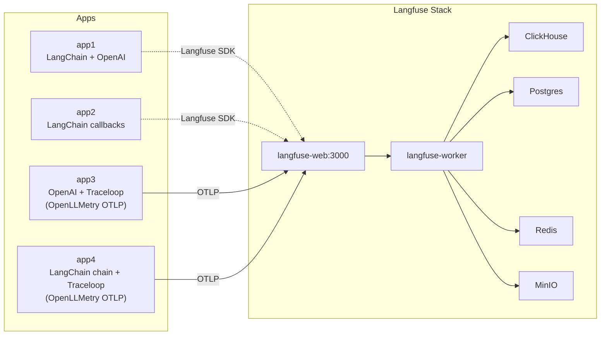
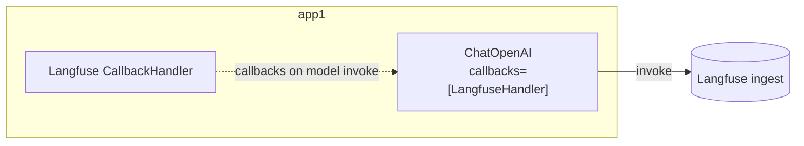
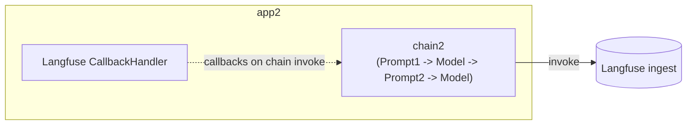
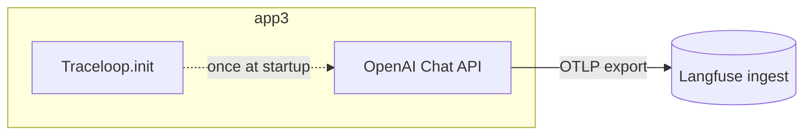
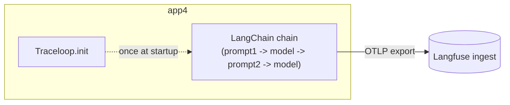

# hello-langfuse-otel メモ (Zenn 下書き用)

コード: https://github.com/optimisuke/hello-langfuse-otel

## ざっくり概要

- Langfuse 自己ホスト (langfuse-web / langfuse-worker / Postgres / Redis / MinIO / ClickHouse) を公式 docker-compose ベースで起動。
- Python アプリを 4 バリアントに分割し、Langfuse へのトレース送信方法を比較。
  - app1: LangChain + OpenAI（基本形）
  - app2: LangChain チェーンにまとめてコールバック渡し
  - app3: OpenAI 素の Chat API + Traceloop (OpenLLMetry) で OTLP を Langfuse ingest に送信
  - app4: LangChain 二段プロンプト + Traceloop (OpenLLMetry) で OTLP を Langfuse ingest に送信
- app3/4 は Traceloop.init で OTLP エンドポイントと Basic 認証ヘッダーを Langfuse に設定し、環境変数だけでトレースを飛ばす最小構成。`TRACELOOP_API_KEY` や独自の APP_NAME 指定は不要にした。

## 感想・気づき

- Docker Compose が思ったよりややこしい。Langfuse スタックは ClickHouse/MinIO/Redis/Postgres に依存するので待ち条件が多い。
- ClickHouse を初使用。公式いわく “ClickHouse is the fastest and most resource efficient real-time data warehouse and open-source database.”
- OpenLLMetry で OTLP を Langfuse に飛ばせたのが好み。最初に環境変数を用意するだけで送信できる。
- ただし OpenLLMetry/Traceloop 側の制約や Langfuse OTEL ingest 周りはもう少し確認したい。

## 図 (Mermaid)



## 各アプリ構成 (Mermaid)









## コアコード抜粋

### app1: モデルに直接コールバック

```python
handler = CallbackHandler(public_key=..., secret_key=..., host=...)
model = ChatOpenAI(model="gpt-4o-mini", callbacks=[handler])
ai_message = model.invoke(messages, config={"run_name": "chat-demo"})
handler.flush()
```

### app2: チェーンを丸ごと callback 付きで実行

```python
handler = CallbackHandler(...)
chain1 = prompt1 | model | StrOutputParser()
chain2 = {"city": chain1, "language": itemgetter("language")} | prompt2 | model | StrOutputParser()
config = {"run_name": "chain2-two-step", "callbacks": [handler]}
answer = chain2.invoke({"person": person, "language": "日本語"}, config=config)
handler.flush()
```

### app3: Traceloop (OpenLLMetry) + OpenAI

```python
auth = base64.b64encode(f"{pk}:{sk}".encode()).decode()
os.environ["OTEL_EXPORTER_OTLP_ENDPOINT"] = f"{base}/api/public/otel"
os.environ["OTEL_EXPORTER_OTLP_HEADERS"] = f"Authorization=Basic {auth}"
Traceloop.init(app_name="app3-openllmetry", disable_batch=True,
               api_endpoint=os.getenv("OTEL_EXPORTER_OTLP_ENDPOINT"),
               headers={"Authorization": f"Basic {auth}"})
resp = OpenAI().chat.completions.create(
    messages=[{"role": "user", "content": "LLM Observabilityって何？"}],
    model="gpt-4o-mini",
)
```

### app4: Traceloop + LangChain 2 段プロンプト

```python
auth = base64.b64encode(f"{pk}:{sk}".encode()).decode()
os.environ["OTEL_EXPORTER_OTLP_ENDPOINT"] = f"{base}/api/public/otel"
os.environ["OTEL_EXPORTER_OTLP_HEADERS"] = f"Authorization=Basic {auth}"
Traceloop.init(app_name="app4-openllmetry", disable_batch=True,
               api_endpoint=os.getenv("OTEL_EXPORTER_OTLP_ENDPOINT"),
               headers={"Authorization": f"Basic {auth}"})

chain1 = prompt1 | model | StrOutputParser()
chain2 = {"city": chain1, "language": itemgetter("language")} | prompt2 | model | StrOutputParser()
answer = chain2.invoke({"person": person, "language": "日本語"}, config={"run_name": "app4-two-step"})
```
